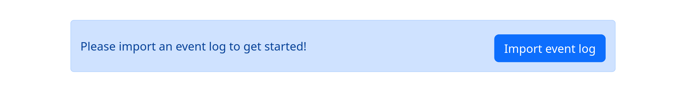
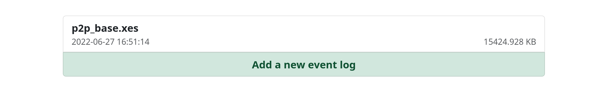
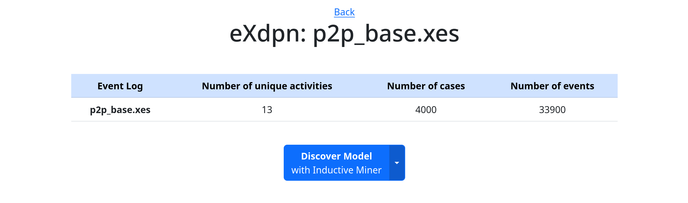
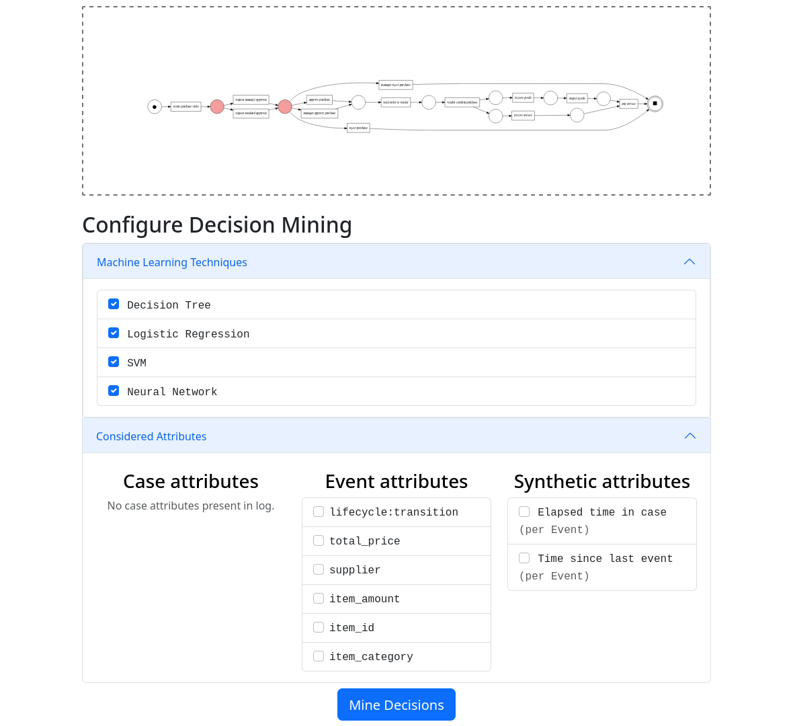
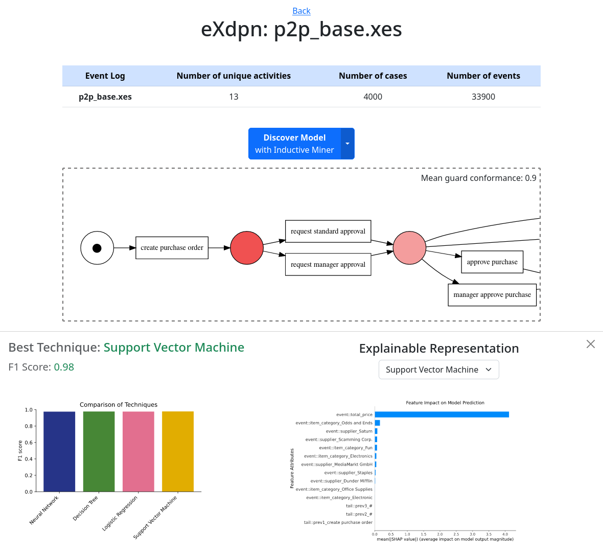

<!--This file is a copy of ./docs/_templates/md/exdpn.md, adding code block denotation around code examples. Please keep this file up to date-->
eXdpn (e**x**plainable **d**ata **P**etri **n**ets) is a tool to mine and evaluate explainable data Petri nets using different classification techniques.

<p align="center">
    
</p>
<p align="center"> 
    Example of explainable representation of a Neural Network guard 
</p>

## **Table of Contents:** ##

- [Getting Started](#getting-started)
- [User Guide Web UI](#user-guide)
    - [Getting Started](#getting-started-1)
    - [Example Run](#example-run)
      - [Discovering a Process Model](#discovering-a-process-model)
      - [Configuring the Mining Parameters](#configuring-the-mining-parameters)
      - [Mining and Viewing Results](#mining-and-viewing-results)
- [Explainable Representation](#explainable-representation)
- [Qualitative Analysis of eXdpn](#qualitative-analysis-of-exdpn)
- [Source Code and UI-application](#source-code-and-ui-application)
---

## Getting Started ##
Installing eXdpn is possible via pip:
```bash
python -m pip install exdpn 
```

Now you can mine your first explainable data Petri net given an event log in XES format:
```python
from exdpn.util import import_log
from exdpn.data_petri_net import Data_Petri_Net
event_log = import_log('<path_to_event_log.xes>')
dpn = Data_Petri_Net(event_log, event_level_attributes=['event_level_attribute'])
```

This will mine a data Petri net for your event log, considering only "event_level_attribute" as a possible attribute for classification. 
The `exdpn.data_petri_net.data_petri_net.Data_Petri_Net` class already takes care of the workflow to create a data Petri net. In cases where fine-grained 
control of the data Petri net creation is needed or only certain functionallity of this package is needed, one can simply call all the needed functions and methods directly. 

Let's say we are only interested in extracting the guard dataset at one specific decision point in the Petri net.
We start off by importing the event log from memory and creating a standard Petri net:

```python
from exdpn.util import import_log
from exdpn.petri_net import get_petri_net
event_log = import_log('<path_to_event_log.xes>')
pn, im, fm = get_petri_net(event_log)
```

We then extract all the decision points and specify our place of interest using the `exdpn.decisionpoints` module:

```python
from exdpn.decisionpoints import find_decision_points
dp_dict = find_decision_points(pn)
decision_point = list(dp_dict.keys())[0]
```

To extract a guard dataset for the specific place `decision_point`, we call the following data extraction function from `exdpn.guard_datasets`:

```python
from exdpn.guard_datasets import extract_all_datasets
dataset = extract_all_datasets(event_log, net, im, fm, event_level_attributes=['event_level_attribute'], places=[decision_point])
```


Further examples can be seen in the API documentation. The sometimes referenced XES file `p2p_base.xes` can be found on Github.

--- 

## User Guide Web UI ##
In the next few sections we will introduce how you can use the web UI to mine decisions in a process. 
### Getting Started ###
When you first run the web UI (either locally or through docker) you will be prompted with the following screen:

Here you can start by importing any existing event log in the XES format.
If you do not have any XES event log at hand, you can try our P2P base event log and download it <a href="https://github.com/aarkue/eXdpn/raw/main/datasets/p2p_base.xes" target="_blank">here</a>.

After importing a local event log, you will see it appear on the page.



To continue select an event log from the list of imported logs.

### Example Run ###
When selecting an event log the log will be loaded to memory and initial statistics about the log (like case or event count) are displayed.



To gain insights into the decisions of the process, you will need to go through the following steps:


1. [Discovering a Process Model](#discovering-a-process-model)
2. [Configuring the Mining Parameters](#configuring-the-mining-parameters)
3. [Mining and Viewing Results](#mining-and-viewing-results)

#### Discovering a Process Model ###
To find where decisions are made in the process, you first have to **discover a process model** for it. This can be done using the Inductive Miner or the Alpha Miner.
Once the process mining is done the discovered accepting Petri net will be displayed on the page, and every decision point is highlighted in red.



#### Configuring the Mining Parameters ###
Next, you can select the **parameters for the decision mining**.
The techniques that should be used can be changed.
By default, all available techniques (Decision Tree, Logistic Regression, Support-vector Machine (SVM), Neural Network) are selected.

In addition, the data on which the machine learning techniques will base their decisions can be configured.
For that, you can choose for each of the following attribute type whether or not it should be considered in the decision mining:
- Case attributes
  - Case attributes are on a case-level and are used for all decisions related to that case
- Event attributes
  - Event-level attributes found in the event log. These attributes are used for decision points occurring immediately after this event
- Synthetic attributes
  - Synthetic attributes are not present in the input event log but added artifically based on other event data
  - The following synthetic attributes are currently available:
      - ***Elapsed time in case***: Time duration since the case started is added as an attribute to every event
      - ***Time since last event***: The duration since the previous event occurred is added as an attribute to every event

#### Mining and Viewing Results ####
By clicking on **Mine Decisions** the decision mining process is started in the background. Please stand by as this might take a few minutes. Once the mining finished, the loading indicator on the button will disappear, and the *mean guard conformance*[^1] will be displayed on the Petri net.

[^1]: The mean guard conformance represents the fraction of cases which can be replayed perfectly on the Data Petri net, respecting all discovered guards.



To **inspect how decisions are made** at a certain part of the process, you can click on one of the colored decision places in the Petri net.
This will open a panel on the bottom, which displays further information on the discovered decision guards for the selected place.

The technique that performed best for the selected place and its corresponding F1 score is shown together with a comparison of the F1 scores of the all other techniques.
Additionally the *explainable representation* of the winning technique is shown and can give further insights into what aspects motivate the decision in question.
To view the explainable representation of other technique, simply select it from the dropdown menu.

---

## Explainable Representation ##
To provide a better understandig of the prediction models created by the used machine learning techniques, we use two types of explainable representations.   
Decision Tree models are represented by simply drawing the detected Decision Tree. Each node represents a splitting point and contains information about the splitting criteria. The leaves show the final classification for all samples in the particular leaf.   
For the explainable representation of Neural Network, Support Vector Machine and Logistic Regression the [SHAP library](https://shap.readthedocs.io/en/latest/index.html) is used. The bar plots show the mean absolute values of the SHAP values of the most important feature attributes. These SHAP values indicate the importance of a feature attribute on the the model prediction. If you are interested in learning more about SHAP values and the theory behind them, please check the references.  
  
References:  
https://towardsdatascience.com/shap-explained-the-way-i-wish-someone-explained-it-to-me-ab81cc69ef30  
https://towardsdatascience.com/using-shap-values-to-explain-how-your-machine-learning-model-works-732b3f40e137  

---

## Qualitative Analysis of eXdpn ##
To provide insight to the eXdpn application, the tool was tested and analyzed using four different synthetic p2p event logs. This allowed us to test whether the different machine learning techniques are able to model the decision-making behavior in the event logs. For each event log different so-called guards have been created. These guards are used to model the behavior at a decision point by either enabling or disabling the possible transitions after the decision point. Each event log focuses on differnt types of decision behavior, like non-random or random decisions, decisions based on nonlinear functions or based on previous activities.  
The qualitative analysis revealed some differences between the four different machine learning techniques. If the decision was made based on the value of a feature attribute, either numerical or categorical, most machine learning guards were able to detect that behavior. This also applies if a decision was made based on previous activities. If the decision points became more complex, guards based on Neural Networks, Support Vector Machines or Logistic Regression often performed better than the corresponding Decision Tree guards.  
The complete analysis can be found on Github ([aarkue/eXdpn](https://github.com/aarkue/eXdpn)).  

---

## Source Code and UI-application ##
The source code of this package is available on Github ([aarkue/eXdpn](https://github.com/aarkue/eXdpn)).
Furthermore, the Github also includes a graphical user interface in the form of a Python-webserver and a Docker container to easily start the web UI locally.  


