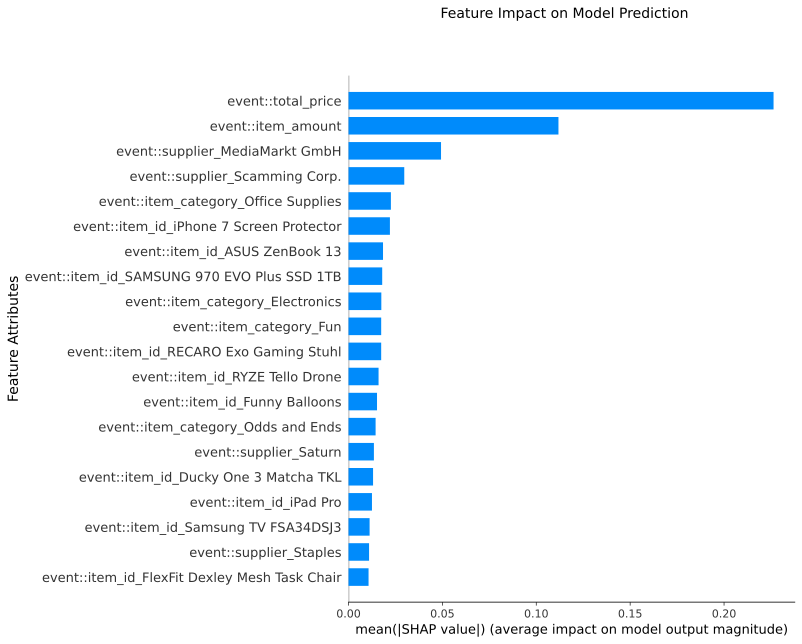

<!--This file is a copy of ./docs/_templates/md/exdpn.md, adding code block denotation around code examples. Please keep this file up to date-->
eXdpn (e**x**plainable **d**ata **P**etri **n**ets) is a tool to mine and evaluate explainable data Petri nets using different classification techniques.

<p align="center">
    
</p>
<p align="center"> 
    Example of explainable representation of a neural network guard 
</p>

---

## Getting Started ##
Installing exdpn is possible via pip:
```bash
python -m pip install exdpn 
```

Now you can mine your first explainable data Petri net given an event log in XES format:
```python
from exdpn.util import import_log
from exdpn.data_petri_net import Data_Petri_Net
event_log = import_log('<path_to_event_log.xes>')
dpn = Data_Petri_Net(event_log, event_level_attributes=['event_level_attribute'])
```

This will mine a data Petri net for your event log, considering only "event_level_attribute" as a possible attribute for classification. 
The `exdpn.data_petri_net.data_petri_net.Data_Petri_Net` class already takes care of the workflow to create a data Petri net. In cases where fine-grained 
control of the data Petri net creation is needed or only certain functionallity of this package is needed, one can simply call all the needed functions and methods directly. 

Let's say we are only interested in extracting the guard dataset at one specific decision point in the Petri net.
We start off by importing the event log from memory and creating a standard Petri net:

```python
from exdpn.util import import_log
from exdpn.petri_net import get_petri_net
event_log = import_log('<path_to_event_log.xes>')
pn, im, fm = get_petri_net(event_log)
```

We then extract all the decision points and specify our place of interest using the `exdpn.decisionpoints` module:

```python
from exdpn.decisionpoints import find_decision_points
dp_dict = find_decision_points(pn)
decision_point = list(dp_dict.keys())[0]
```

To extract a guard dataset for the specific place `decision_point`, we call the following data extraction function from `exdpn.guard_datasets`:

```python
from exdpn.guard_datasets import extract_all_datasets
dataset = extract_all_datasets(event_log, net, im, fm, event_level_attributes=['event_level_attribute'], places=[decision_point])
```


Further examples can be seen in the API documentation. The sometimes referenced XES file `p2p_base.xes` can be found on Github.

---
## Explainable Representation ##
To provide a better understandig of the prediction models created by the used machine learning techniques, we use two types of explainable representations.   
Decision Tree models are represented by simply drawing the detected Decision Tree. Each node represents a splitting point and contains information about the splitting criteria. The leaves show the final classification for all samples in the particular leaf.   
For the explainable representation of Neural Network, Support Vector Machine and Logistic Regression the [SHAP library](https://shap.readthedocs.io/en/latest/index.html) is used. The bar plots show the mean absolute values of the SHAP values of the most important feature attributes. These SHAP values indicate the importance of a feature attribute on the the model prediction. If you are interested in learning more about SHAP values and the theory behind them, please check the references.  
  
References:  
https://towardsdatascience.com/shap-explained-the-way-i-wish-someone-explained-it-to-me-ab81cc69ef30  
https://towardsdatascience.com/using-shap-values-to-explain-how-your-machine-learning-model-works-732b3f40e137

---

## Source Code and UI-application ##
The source code of this package is available on Github ([aarkue/eXdpn](https://github.com/aarkue/eXdpn)).
Furthermore, the Github also includes a graphical user interface in the form of a Python-webserver and a Docker container to easily start the web-UI locally. 

---

## Qualitative Analysis of eXdpn ##
To provide insight to the eXdpn application, the tool was tested and analyzed using four different synthetic p2p event logs. This allowed us to test whether the different machine learning techniques are able to model the decision-making behavior in the event logs. For each event log different so-called guards have been created. These guards are used to model the behavior at a decision point by either enabling or disabling the possible transitions after the decision point. Each event log focuses on differnt types of decision behavior, like non-random or random decisions, decisions based on nonlinear functions or based on previous activities.  
The qualitative analysis revealed some differences between the four different machine learning techniques. If the decision was made based on the value of a feature attribute, either numerical or categorical, most machine learning guards were able to detect that behavior. This also applies if a decision was made based on previous activities. If the decision points became more complex, guards based on Neural Networks, Support Vector Machines or Logistic Regression often performed better than the corresponding Decision Tree guards.  
The complete analysis can be found on Github ([aarkue/eXdpn](https://github.com/aarkue/eXdpn)).

---
